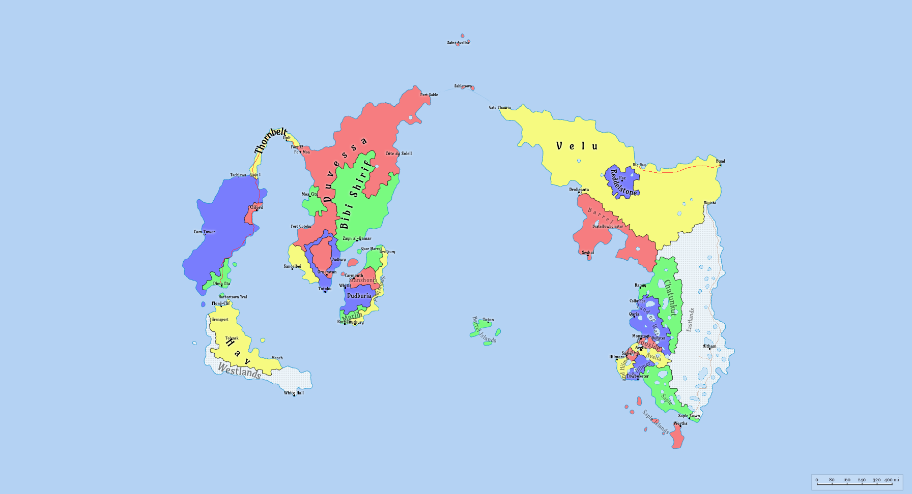

== Yanorra

:doctype: book
:toc: left
:toclevels: 3

== Summary 

Yanorra is a terrestrial planet in a state of societal and environmental crisis. 

Roughly 400 Earth years ago, a massive celestial object, called Lo-Disporum, entered the solar system and disrupted the stable orbit of Yanorra, throwing the planet into an unstable elliptical orbit. 

This event became known as **The Drift**.

As the orbit became more elliptical, summers have become shorter and hotter; winters longer and colder. Yanorran astronomers are uncertain of the planet's fate -- whether it will fall into its star or be ejected from its system.

The Drift stunted global development and triggered long-term societal depression, as most people believe extinction is inevitable.

== Astronomical Properties
* Terrestrial, Earth-sized
* Rotational cycle ≈ 1 Earth day
* Yearly cycle = Increasingly unpredictable, no longer follows a fixed calendar. Calendar system is based on cycles (i.e. days) rather than years.

=== Celestial Satellites

Yanorra has two satellites. Their competing gravitation has made sea travel difficult -- an issue amplified by The Drift.

* **Serya** - Larger moon, stable, linked to timekeeping and tradition.
* **Mirelda** - Smaller, erratic moon associated with misfortune and tidal chaos.

=== Local Star

Yanorra orbits a single star called the **Ember Mother** which has a slight red hue. The Ember Mother has remained stable since The Drift. 

== Geography

The **known world** consists of two main continents: **East Yanorra** and **West Yanorra**, separated by the **Veloku Ocean**. Each continent contains several nations and loosely organized regions.

=== Historical Context

The existence of other continents or landmasses is a subject of debate. Numerous myths and stories describe lands beyond the known world, most originating shortly before The Drift, when oceanic exploration was still possible.

**Deedrik the Explorer** was a renowned traveler who claimed to have journeyed beyond the Eastvoid Ocean, returning with unusual artifacts, wildlife, and plants from a place he called **Aunqara**.

A group known as the **Aunqaran** is said to have accompanied Deedrik back and settled in Velu and other areas of the known world. Today, the existence of Aunqara, and the origination of the Aunqaran, is widely disputed and considered by many to be a myth. The Aunqaran themselves are now a small, insular group, concentrated in Velu, and claim to maintain cultural ties to Aunqara.

Since The Drift, several attempts to cross the Eastvoid Ocean in search of Aunqara have ended in failure, with no one returning.

=== East Yanorra

East Yanorra is the easternmost continent in the known world of Yanorra. 

==== List of States and Territories in East Yanorra

[cols="1,1,1,1", options="header"]
|===
| Name | Area | Population | Capital
| link:./Wiki/Avelia.md[Avelia]              | 10,000 sq km      | (TBD)          | Avelis          
| link:./Wiki/Barrel.md[Barrel]              | 41,000 sq km      | (TBD)          | Seshai          
| link:./Wiki/Booside.md[Booside]            | 4,700 sq km       | (TBD)          | Monstagt        
| link:./Wiki/Chatunkut.md[Chatunkut]        | 52,000 sq km      | (TBD)          | Rangy           
| link:./Wiki/Eastlands.md[Eastlands]        | 217,000 sq km     | (TBD)          | ...             
| link:./Wiki/Eve_Hilmore.md[Eve Hilmore]    | 8,000 sq km       | (TBD)          | Towboketer      
| link:./Wiki/Grand_Hilmore.md[Grand Hilmore]| 6,400 sq km       | (TBD)          | Hilmore         
| link:./Wiki/Land_of_Water.md[Land of Water]| 29,000 sq km      | ~1,100,000     | Qaria           
| link:./Wiki/Larx.md[Larx]                  | 3,000 sq km       | (TBD)          | Saple           
| link:./Wiki/Reddelstone.md[Reddelstone]    | 150,000 sq km     | ~300,000       | Paz             
| link:./Wiki/Saple.md[Saple]                | 31,000 sq km      | (TBD)          | Saple Town      
| link:./Wiki/Saple_Islands.md[Saple Islands]| 9,300 sq km       | (TBD)          | Worths          
| link:./Wiki/Velu.md[Velu]                  | 200,000 sq km     | ~500,000       | Byad
|===

=== West Yanorra

West Yanorra is the western most continent in the known world of Yanorra. It is divided into four major regions:

- **Dudbinia**: A large island in the southeastern region of West Yanorr.

- **Eanorra** - The eastern part of West Yanorra, which includes Duvessa, Moe, Bibi Shirif and the Three Sisters (Totoku, Endotoku, Obetoku).   

- **Sounorra** - A sparsely populated large island in the southern region of West Yanorra. Sounorra is known for it's wildlands and harsh weather.

- **Wanorra** - The western part of West Yanorra, which includes Ronobetu, Tsutodo, and S'Tsutodo.

==== List of States and Territories in West Yanorra

[cols="1,1,1,1,1", options="header"]
|===
| Name | Area (approx.) | Population | Capital | Region
| link:./Wiki/Bharim_Islands.md[Bharim Islands] | 8,200 sq km | ~1.2 million | Thetbury | Dudbinia
| link:./Wiki/Bibi_Shirif.md[Bibi Shirif] | 220,000 sq km | ~1.5 million | Zayn al-Qamar | Wanorra
| link:./Wiki/Duvessa.md[Duvessa] | 310,000 sq km | ~800,000 | Côte du Soleil | Wanorra
| link:./Wiki/Endotoku.md[Endotoku] | 180,000 sq km | ~300,000 | Ornerston | Wanorra
| link:./Wiki/Hav.md[Hav] | 500,000 sq km | ~50,000 | Flord-Clif | Sounorra
| link:./Wiki/Obetoku.md[Obetoku] | 120,000 sq km | ~700,000 | Sanceibei | Wanorra
| link:./Wiki/Ronobetu.md[Ronobetu] | 350,000 sq km | ~1.9 million | Cam Tower | Eanorra
| link:./Wiki/S_Tsutodo.md[S'Tsutodo] | 200,000 sq km | ~700,000 | Dima Eta | Eanorra
| link:./Wiki/Samerland.md[Samerland] | 15,000 sq km | ~1.2 million | Thetbury | Dudbinia
| link:./Wiki/Soumoa.md[Soumoa] | 140,000 sq km | ~1 million | Moa City | Wanorra
| link:./Wiki/Stanshonia.md[Stanshonia] | 14,000 sq km | ~1.5 million | Carmouth | Dudbinia
| link:./Wiki/Thornbelt.md[Thornbelt] | 210,000 sq km | ~800,000 | Holt | Eanorra
| link:./Wiki/Totoku.md[Totoku] | 80,000 sq km | ~600,000 | Totoku | Wanorra
| link:./Wiki/Tsutodo.md[Tsutodo] | 160,000 sq km | ~400,000 | Cliford | Eanorra
| link:./Wiki/Westlands.md[Westlands] | 50,000 sq km | (TBD) | ... | Sounorra
|===

==== The Three Sisters

The Three Sisters are a group of three nations located in southern Eanorra. The name __Three Sisters__ comes from pre-Drift ruler, Kind Aputoku, who ruled all of Eanorra and gifted his three daughters (Ende, Obe, and Tsue) with the lands that would each become their own nation. 

In the modern era, the three nations share culture and language, as well as resources. Free trade exists between the three nations, though they remain politically independent. 

=== The Brooding Sea
- Sea separating Eanorra and Wanorra, with Thornbelt in the north acting as a land bridge between the two sub-continents.
- Cold, unstable waters with large swells and unpredictable storms
- Given the relative proximity of East-West Yanorra and West-West Yanorra, the Brooding Sea is considered a dangerous barrier to maritime travel. Less than 200 miles apart at its narrowest point, only about 20% of ships attempting to cross the Brooding Sea survive the journey.

=== Aunqara
- Mythical land beyond the Eastvoid Ocean.
- Believed to hold relics, knowledge, or salvation.
- No confirmed sightings.

=== Veloku Ocean
- Large ocean separating East Yanorra (Velu) from West Yanorra (Duvessa).
- Ships have not been able to navigate it since The Drift.
- Travel from West Yanorra to East Yanorra now requires a stop in the Riftlands.

=== Eastvoid Ocean
- Ocean separating East Yanorra from the mythical land of Aunqara.

=== Westvoid Ocean
(TBD)

== Calendar System

Time used to be measured in years, but after The Drift, the concept of a "year" became unreliable due to the planet's erratic orbit. Now time is measured by rotations the planet makes on its axis, called "cycles". These cycles are roughly equivalent to one Earth day.

    - 1 cycle   = day
    - 1 decara  = 10 cycles
    - 1 centara = 100 cycles
    - 1 milarna = 1,000 cycles

Dates are written in the format: milarnas.centaras.decara.cycles, where each unit represents a place value.

[cols="1,1,1,1", options="header"]
|===
| Megnara (1,000,000 cycles per) | Kilara (1,000 cycles per) | Decara (10 cycles per) | Cycles (1 cycle)
| unlimited | 0-999 | 0-99 | 0-9
|===

The current date is approximately `146.10.0`, meaning that about 146,100 days have passed since The Drift, or about 400 Earth years.

== Geopolitics

=== Duvessa-Velu Sea Trade
- Goods flow from **Port Sable** (mainland Duvessa) to **Sabletown** (on Sable Island in the Riftlands).
- Most ships stop in **Sabletown** before heading east or west.
- Velu's **Gate Thaurin** is the only sanctioned port for Velu-bound ships.

== World Technology

=== Communication
- No cell towers or internet infrastructure ever developed.
- Handheld devices function via packet radio or shortwave relays.
- Signal range is limited to line-of-sight or tower bounce.
- Interference is common; messages are delayed or lost.

=== Power
- Electricity is common in larger cities and towns, but can be unreliable.
- Sources: solar panels, wind-up generators, diesel (rare).
- Kerosene, firewood, and candles are still in daily use.

=== Transportation
- No airplanes or helicopters exist.
- Oceanic ships are limited to coastal or short-island routes.
- No vessels capable of transoceanic navigation.
- Steam and diesel engines power trawlers and ferries.

=== Computing
- Computers euivalent to those of the late 80s and early 90s exist
- A basic Internet-like system does exists -- think Compuserve
- Mechanical tools, analog radios, and paper systems dominate.
- Film photography exists but is uncommon due to scarcity of materials.

