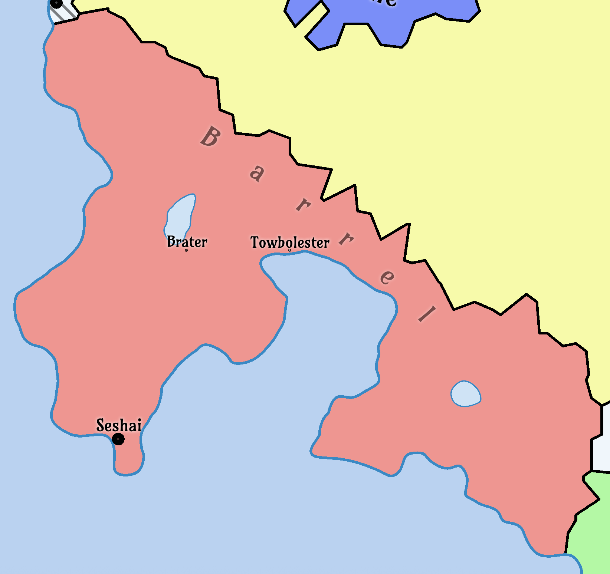

# Barrel

## Table of Contents

- [Overview](#overview)
- [Geography](#geography)
- [Climate](#climate)
- [History](#history)
- [Politics](#politics)
- [Economy](#economy)
- [Culture](#culture)
- [Technology](#technology)
- [Military](#military)
- [Demographics](#demographics)
- [Infrastructure](#infrastructure)
- [Environment](#environment)
- [Notable Events](#notable-events)

**Barrel** is a nation.

## Overview

- **Name**: Barrel  
- **Capital**: Seshai
- **Largest City**: Seshai (population: 202,103)
- **Area**: (TBD) km² ((TBD) sq mi)
- **Government**: (TBD)
- **Official Language**: (TBD)  
- **Population**: 3M (estimated)  
- **Currency**: (TBD)  
- **Religion**: (TBD)  

## Geography

Barrel is a nation located in East Yanorra. It is bordered by Velu to the east, and the Veloku Ocean to the west. The shores of barrel are flat and fertile land, with the interior being very mountainous and rugged. 

### Key Regions

#### Sashai

#### Brater Lake

Brater Lake is a large freshwater lake located in the interior of Barrel. It is surrounded by steep mountains and dense forests, making it a secluded and picturesque area. On its shore is the town of Brater, which serves as a fishing port for the region. The lake is known for its crystal-clear waters and abundant fish population.

#### The Barrel Islands

The Barrel islands are a large archipelago located roughly halfway between East Yanorra and West Yanorra in the southern Veloku Ocean. The islands were characterized by steep cliffs and lush forests. In total there were over 100 islands, with the largest being about 150 km in length

### Location

(TBD)

### Terrain 

(TBD)

### Additional Regions

(TBD)

### Climate

(TBD)

## History

### Pre-Drift Era (~500,000 cycles ago, ~1,369 Earth years)

Before The Drift, Barrel was a prosperous maritime power in East Yanorra. Situated on the western coastline with sheltered harbors and skilled shipwrights, Barrel became the foremost facilitator of commerce across the Veloku Ocean.

Its greatest advantage was its control of the Barrel Islands — a large, strategically placed archipelago located nearly halfway between East Yanorra and West Yanorra in the southern Veloku Ocean. These islands served as a vital resupply point, allowing merchants to break the otherwise perilous voyage into manageable legs.

The Barrel fleet was famed for its speed and reliability, and merchants from both East and West Yanorra relied on its captains to move goods, people, and information. Some historians argue that without Barrel, true intercontinental trade between the East and West Yanorra would have developed centuries later.

### The Drift (~146,100 cycles ago, ~400 Earth years)

### Post-Drift Era (~145,000–130,000 cycles ago, ~397–356 Earth years)

With the Veloku crossing severed, Barrel’s economy collapsed almost immediately. Shipbuilding shifted from vast ocean-going galleons to smaller coastal craft, and the once-grand harbors silted over.

The fate of the Barrel Islands remained unknown. Attempts to reestablish contact always ended the same way: without return. Even the most well-prepared expeditions left no trace, their disappearance feeding both grief and romanticized tales of a hidden paradise, a cursed ruin, or a thriving society that had chosen to remain isolated.

The loss reshaped the nation’s culture. Songs, festivals, and seafaring traditions came to center on remembrance and the yearning for reunion.

### Current Era (~146,100 cycles, ~400 Earth years since The Drift)

### The Barrel Island

The Barrel Islands are an archipelago located in the southern Veloku Ocean, roughly halfway between East Yanorra and West Yanorra, that once served as a vital resupply point for maritime trade before The Drift.

When The Drift disrupted Yanorra’s orbit and climate, the Veloku Ocean was transformed almost overnight. Warm currents vanished, replaced by chaotic, colliding flows; entire weather systems shifted unpredictably; and storms of unprecedented violence swept the open waters.

The Barrel Islands, once a bustling midpoint of civilization, suddenly became inaccessible to the trade network as all known routes turned impassable. Survivors from failed voyages spoke of towering rogue waves, or skies that blackened in minutes before crushing winds tore masts to splinters.

The islands quickly became legend — their harbors, settlements, and people swallowed by the unreachable horizon. 

This began a tradition known as the **Voyage of Remembrance**. 

Every year on the same day, known as **Island Day**, a single stout vessel is prepared over many decara — its hull reinforced, its sails sewn with hand-dyed cloth, and its figurehead carved anew each year. Volunteers, often descendants of families who once lived on the islands, load it with supplies, livestock, crafted gifts, and handwritten letters.

The ship departs at dawn amid ceremonies, the docks crowded with thousands of onlookers. Bells toll, horns sound, and flower petals are scattered on the waves as the vessel slips into the southern horizon. No ship has ever returned. 

Voyages from other nations, such as Samariland and Bibi Shirif, have also been attempted, but all ended in failure. The only anomaly came decades ago, when the remains of a small fishing boat washed ashore near Seshai, its hull shattered but its mast still intact — carved in a style unrecognized by any shipbuilder in Barrel or beyond.

Some claim this is proof the islanders still live, taking in the voyagers but forbidding their return. Others believe the expeditions are swallowed by the ocean. 

Regardless, the islands are now considered a lost, with the fate of the islands and their inhabitants unknown.

## Politics

- **Government**: (TBD)  
- **Foreign Relations**: (TBD)  
- **Key Issues**: (TBD)

## Economy

- **Overview**: (TBD)  
- **Main Exports**: (TBD)  
- **Main Imports**: (TBD)  
- **Trade Hubs**: (TBD)  
- **Challenges**: (TBD)

## Culture

- **Cultural Influences**: (TBD)  
- **Religion**: (TBD)  
- **Society**: (TBD)  

## Technology

- **Communication**: (TBD)  
- **Power**: (TBD)  
- **Transportation**: (TBD)  
- **Computing**: (TBD)

## Military

- **Overview**: (TBD)  
- **Key Conflicts**: (TBD)

## Demographics

- **Population**: 700,000 (estimated)  
- **Ethnicity**: (TBD)  
- **Languages**: (TBD)  

## Infrastructure

- **Ports**: (TBD)  
- **Fortifications**: (TBD)  
- **Housing**: (TBD)

## Environment

- **Post-Drift Effects**: (TBD)  
- **Natural Resources**: (TBD)

## Notable Events

(TBD)
