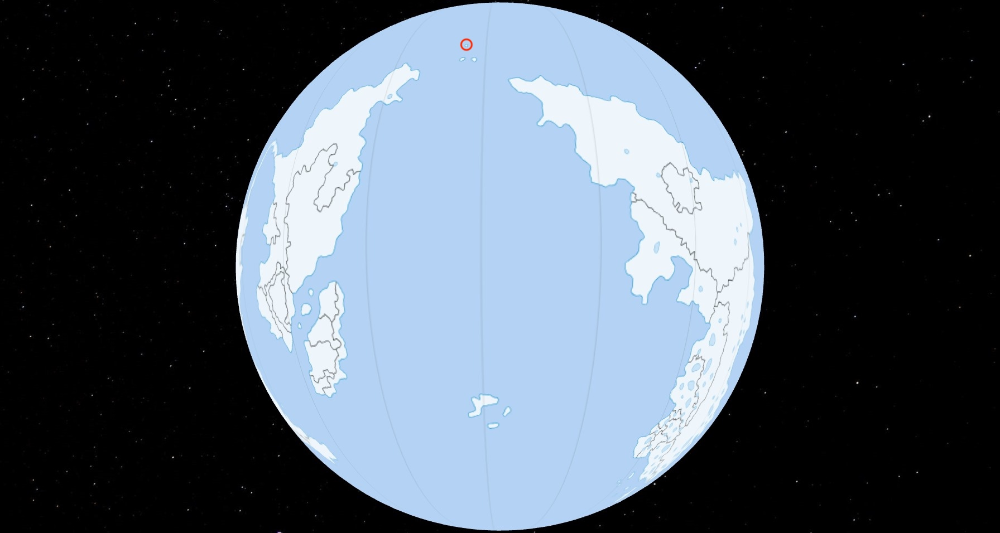
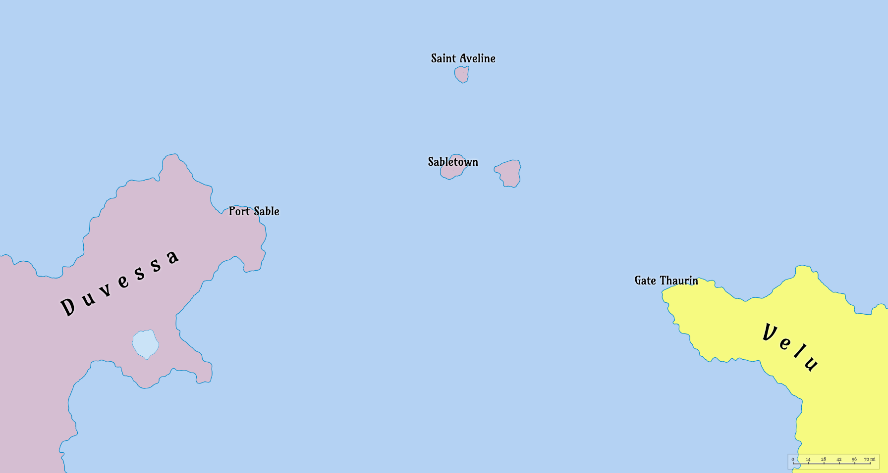

# Reddelstone

**Reddelstone** is a landlocked region located in the mountainous interior of central Velu.

---

## Geography

**Location**: 

---

## Climate and Environment

---

## Political Status

---

## Settlement and Population

---

## Economy and Supply

---

## Cultural Significance

---

## Historical Context

---

*See also:* [Anqara](./Anqara.md), [Velu](./Velu.md). [Nashi](./Nashi.md), [Paz](./Paz.md).
